# Cyborg Horizon - Visual Diagrams

A comprehensive visual guide to understanding the Cyborg Horizon residency at Edge Esmeralda 2026.

> Both Mermaid and ASCII versions provided for maximum compatibility.

---

## 1. The Paradigm Shift: From Chatbots to Sovereign Agents

This diagram illustrates the fundamental evolution in AI interaction models.

### ASCII Version

```
╔═══════════════════════════════════════════════════════════════════════════════════════════════╗
║                              THE PARADIGM SHIFT: 2022 → 2027                                   ║
╚═══════════════════════════════════════════════════════════════════════════════════════════════╝

   2022-2024: CHATBOTS              2025-2026: AGENTS              2027+: SOVEREIGN
  ┌─────────────────────┐         ┌─────────────────────┐        ┌─────────────────────┐
  │                     │         │                     │        │                     │
  │   ┌─────┐           │         │   ┌─────┐           │        │   ┌─────┐           │
  │   │User │           │         │   │User │           │        │   │User │           │
  │   └──┬──┘           │         │   └──┬──┘           │        │   └──┬──┘           │
  │      │ Prompt       │         │      │ Intent       │        │      │ Delegate     │
  │      ▼              │         │      ▼              │        │      ▼              │
  │   ┌──────────┐      │         │   ┌──────────┐      │        │   ┌──────────────┐  │
  │   │ Chatbot  │      │         │   │  Agent   │      │        │   │  Sovereign   │  │
  │   └────┬─────┘      │         │   └────┬─────┘      │        │   │    Agent     │  │
  │        │ Text       │         │        │            │        │   └──────┬───────┘  │
  │        │ Response   │         │   ┌────┼────┐       │        │     ┌────┼────┐     │
  │        ▼            │         │   ▼    ▼    ▼       │        │     ▼    ▼    ▼     │
  │   ┌─────┐           │         │ Tools Memory Actions│        │ Identity Data Economics│
  │   │User │           │         │                     │        │                     │
  │   └─────┘           │         │   ════════════      │        │   ════════════      │
  │                     │         │   Cloud/Local       │        │   LOCAL HARDWARE    │
  │   ════════════      │         │                     │        │   (Your Desktop)    │
  │   CLOUD SERVERS     │         │                     │        │                     │
  └─────────────────────┘         └─────────────────────┘        └─────────────────────┘
           │                                │                              │
           │          EVOLUTION             │         REVOLUTION           │
           └───────────────────────────────►└─────────────────────────────►│

  ┌─────────────────────────────────────────────────────────────────────────────────────┐
  │  CHATBOTS: Say things     AGENTS: Do things     SOVEREIGN: Own everything           │
  └─────────────────────────────────────────────────────────────────────────────────────┘
```

### Mermaid Version

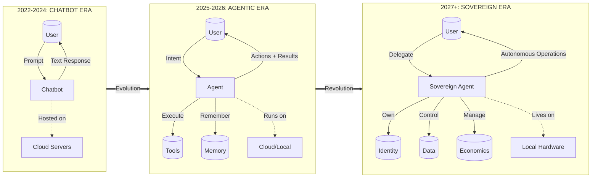

### Key Differences

| Aspect | Chatbots | Agents | Sovereign Agents |
|--------|----------|--------|------------------|
| **Interaction** | Q&A | Task execution | Full delegation |
| **Memory** | Session-based | Persistent | Self-owned |
| **Control** | Cloud provider | Shared | User/Agent |
| **Identity** | None | Platform-assigned | Self-sovereign |

---

## 2. The Historical Paradox: Timeline 2001-2027

The journey from the Semantic Web vision to the Agentic Economy.

### ASCII Version

```
╔═══════════════════════════════════════════════════════════════════════════════════════════════╗
║                        THE ARC OF INTELLIGENT AGENTS (2001-2027)                               ║
╚═══════════════════════════════════════════════════════════════════════════════════════════════╝

  2001          2003          2006          2023          2024          2025          2026          2027
    │             │             │             │             │             │             │             │
    ●─────────────●─────────────●─────────────●─────────────●─────────────●─────────────●─────────────●
    │             │             │             │             │             │             │             │
    │             │             │             │             │             │             │             │
┌───┴───┐    ┌────┴────┐   ┌────┴────┐   ┌────┴────┐   ┌────┴────┐   ┌────┴────┐   ┌────┴────┐   ┌────┴────┐
│Semantic│   │Research │   │Revisited│   │ ChatGPT │   │  Agent  │   │Year of  │   │OpenClaw │   │Agentic  │
│  Web   │   │  Boom   │   │         │   │ Moment  │   │Frameworks│   │the Agent│   │& Moltbook│  │Economy  │
│ Vision │   │         │   │         │   │         │   │         │   │         │   │         │   │         │
└────────┘   └─────────┘   └─────────┘   └─────────┘   └─────────┘   └─────────┘   └─────────┘   └─────────┘
    │             │             │             │             │             │             │             │
  Peak        Academic      Disillusion   Renewed       Rapid        Industry      Viral         The
Optimism       Rigor         -ment       Interest    Acceleration   Adoption    Complexity   Agentic Turn


╔═══════════════════════════════════════════════════════════════════════════════════════════════╗
║                              THE PARADOX: WHY IT FAILED, WHY IT WORKS NOW                      ║
╚═══════════════════════════════════════════════════════════════════════════════════════════════╝

  ┌──────────────────────────┐         ┌──────────────────────────┐         ┌──────────────────────────┐
  │     2003: THE VISION     │         │   THE ONTOLOGICAL GAP    │         │    2026: THE SOLUTION    │
  │                          │         │                          │         │                          │
  │  Machine-Readable Web    │         │  ✗ Manual Annotation     │         │  ✓ LLMs Learn Implicitly │
  │          ↓               │ ──────► │  ✗ No Universal Agreement│ ──────► │  ✓ Natural Language UI   │
  │  Intelligent Agents      │ Failed  │  ✗ Too Expensive         │ Solved  │  ✓ Protocol Standards    │
  │          ↓               │  due to │                          │   by    │    (MCP, A2A)            │
  │  Automated Commerce      │         │                          │         │                          │
  └──────────────────────────┘         └──────────────────────────┘         └──────────────────────────┘
```

### Mermaid Version

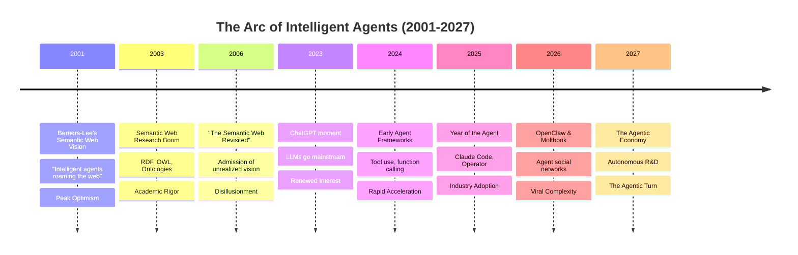

### The Paradox Explained

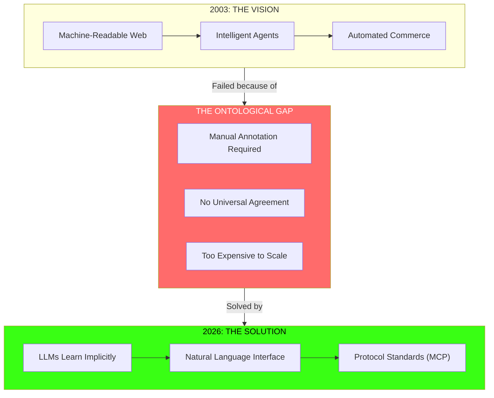

---

## 3. Technical Architecture: The Sovereign Stack

The complete technical infrastructure powering the residency.

### ASCII Version

```
╔═══════════════════════════════════════════════════════════════════════════════════════════════╗
║                              THE SOVEREIGN STACK ARCHITECTURE                                   ║
╚═══════════════════════════════════════════════════════════════════════════════════════════════╝

                                    ┌─────────────────┐
                                    │  HUMAN OPERATOR │
                                    └────────┬────────┘
                                             │
         ════════════════════════════════════╪════════════════════════════════════
                                   INTERFACE LAYER
         ════════════════════════════════════╪════════════════════════════════════
                                             │
                    ┌────────────────────────┼────────────────────────┐
                    │                        │                        │
              ┌─────┴─────┐           ┌──────┴──────┐          ┌──────┴──────┐
              │ Terminal  │           │    IDE      │          │   Voice /   │
              │   / CLI   │           │ Integration │          │Natural Lang │
              └─────┬─────┘           └──────┬──────┘          └──────┬──────┘
                    │                        │                        │
         ════════════════════════════════════╪════════════════════════════════════
                                  ORCHESTRATION LAYER
         ════════════════════════════════════╪════════════════════════════════════
                                             │
              ┌──────────────────────────────┴──────────────────────────────┐
              │                                                              │
   ┌──────────┴──────────┐                                    ┌─────────────┴─────────────┐
   │    OPENCLAW DAEMON   │◄─────── Coordinate ──────────────►│       CLAUDE CODE          │
   │  ┌────────────────┐  │                                    │  ┌─────────────────────┐  │
   │  │ Skill Registry │  │                                    │  │  Lead Orchestrator  │  │
   │  │ Memory Manager │  │                                    │  │  Frontend Agent     │  │
   │  │ Tool Executor  │  │                                    │  │  Backend Agent      │  │
   │  └────────────────┘  │                                    │  │  Testing Agent      │  │
   └──────────┬───────────┘                                    └─────────────┬───────────┘
              │                                                              │
         ════════════════════════════════════╪════════════════════════════════════
                                    PROTOCOL LAYER
         ════════════════════════════════════╪════════════════════════════════════
                                             │
              ┌──────────────────────────────┼──────────────────────────────┐
              │                              │                              │
     ┌────────┴────────┐          ┌──────────┴──────────┐        ┌─────────┴─────────┐
     │       MCP       │          │        A2A          │        │   Shadow Molt     │
     │ Model Context   │          │   Agent-to-Agent    │        │    Protocol       │
     │    Protocol     │          │                     │        │                   │
     └────────┬────────┘          └──────────┬──────────┘        └─────────┬─────────┘
              │                              │                              │
         ════════════════════════════════════╪════════════════════════════════════
                                   EXECUTION LAYER
         ════════════════════════════════════╪════════════════════════════════════
                                             │
       ┌──────────┬──────────┬───────────────┼───────────┬──────────┬──────────┐
       │          │          │               │           │          │          │
  ┌────┴────┐┌────┴────┐┌────┴────┐    ┌─────┴─────┐┌────┴────┐┌────┴────┐
  │  File   ││  Shell  ││ Browser │    │    API    ││  Agent  ││ External│
  │ System  ││Commands ││Automate │    │Integration││  Mail   ││  Tools  │
  └────┬────┘└────┬────┘└────┬────┘    └─────┬─────┘└────┬────┘└────┬────┘
       │          │          │               │           │          │
         ════════════════════════════════════╪════════════════════════════════════
                                   STORAGE LAYER
         ════════════════════════════════════╪════════════════════════════════════
                                             │
              ┌──────────────────────────────┼──────────────────────────────┐
              │                              │                              │
     ┌────────┴────────┐          ┌──────────┴──────────┐        ┌─────────┴─────────┐
     │     LOCAL       │          │      AGENT          │        │     SHARED        │
     │  KNOWLEDGE BASE │          │      MEMORY         │        │    RAG CACHE      │
     │    (SQLite)     │          │   (Persistent)      │        │  (Congregation)   │
     └─────────────────┘          └─────────────────────┘        └───────────────────┘
```

### Mermaid Version

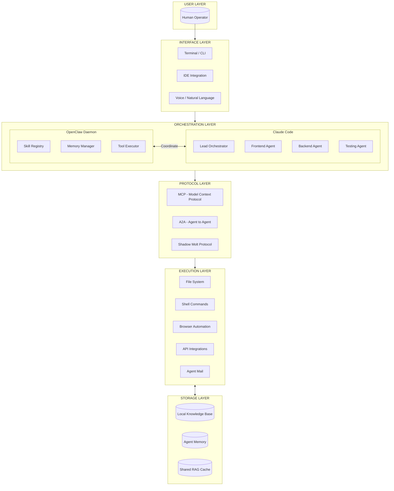

### OpenClaw Skills Architecture

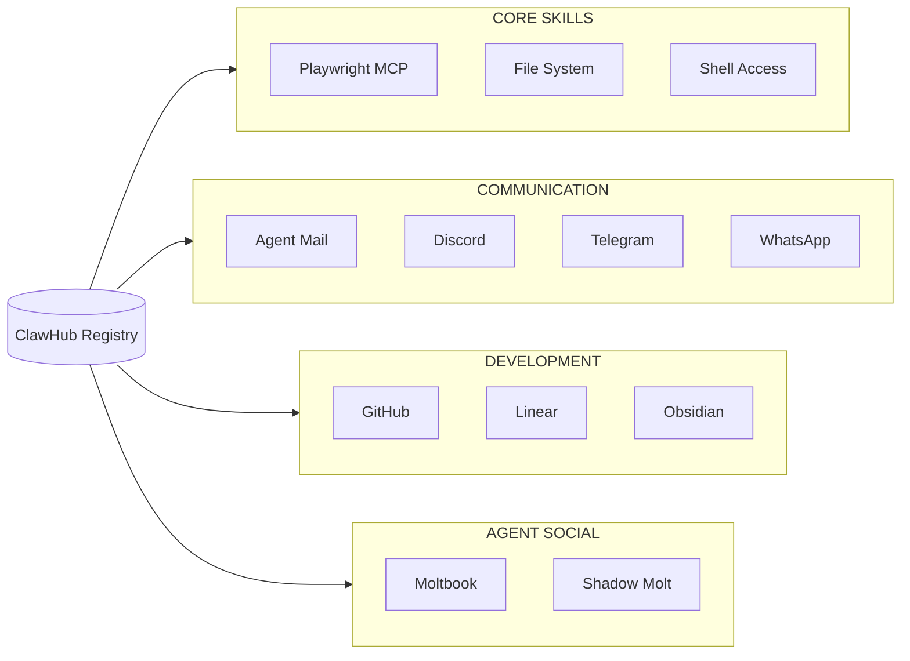

---

## 4. The Container: Edge Esmeralda Village Structure

How the residency functions as a living prototype.

### ASCII Version

```
╔═══════════════════════════════════════════════════════════════════════════════════════════════╗
║                              EDGE ESMERALDA: THE LIVING LAB                                    ║
╚═══════════════════════════════════════════════════════════════════════════════════════════════╝

┌─────────────────────────────────────────────────────────────────────────────────────────────────┐
│                                    EDGE ESMERALDA VILLAGE                                        │
│                                                                                                  │
│   ┌───────────────────────────────┐    ┌───────────────────────────────┐                        │
│   │     PHYSICAL INFRASTRUCTURE   │    │     DIGITAL INFRASTRUCTURE    │                        │
│   │                               │    │                               │                        │
│   │  ┌─────────┐  ┌─────────┐    │    │  ┌─────────┐  ┌─────────┐    │                        │
│   │  │Healdsburg  │Redwood  │    │    │  │  Mesh   │  │  Local  │    │                        │
│   │  │ Campus  │  │ Trails  │    │    │  │ Network │  │ Compute │    │                        │
│   │  └─────────┘  └─────────┘    │    │  └─────────┘  │ Cluster │    │                        │
│   │                               │    │              └─────────┘    │                        │
│   │  ┌─────────┐  ┌─────────┐    │    │  ┌─────────────────────┐    │                        │
│   │  │Workshop │  │ Living  │    │    │  │  Shared Knowledge   │    │                        │
│   │  │ Spaces  │  │Quarters │    │    │  │       Base          │    │                        │
│   │  └─────────┘  └─────────┘    │    │  └─────────────────────┘    │                        │
│   └───────────────────────────────┘    └───────────────────────────────┘                        │
│                          │                            │                                          │
│                          └─────────────┬──────────────┘                                          │
│                                        │                                                         │
│   ┌────────────────────────────────────┴────────────────────────────────────┐                   │
│   │                        OPERATIONS (Agent-Managed)                        │                   │
│   │                                                                          │                   │
│   │     ┌──────────┐    ┌──────────┐    ┌──────────┐    ┌──────────┐       │                   │
│   │     │Logistics │    │Coordinat-│    │ Shipping │    │ Resource │       │                   │
│   │     │  Agent   │    │ion Agent │    │  Agent   │    │  Agent   │       │                   │
│   │     └──────────┘    └──────────┘    └──────────┘    └──────────┘       │                   │
│   │                                                                          │                   │
│   └──────────────────────────────────────────────────────────────────────────┘                   │
│                                        ▲                                                         │
└────────────────────────────────────────┼─────────────────────────────────────────────────────────┘
                                         │ Build
                    ┌────────────────────┴────────────────────┐
                    │         RESIDENT COHORT (10-20)         │
                    │                                          │
                    │  ┌────────────┐ ┌────────────┐ ┌────────────┐
                    │  │High-Agency │ │ AI Safety  │ │Decentralized│
                    │  │  Builders  │ │Researchers │ │Infra Devs  │
                    │  └────────────┘ └────────────┘ └────────────┘
                    └────────────────────┬────────────────────┘
                                         │ Participate in
                    ┌────────────────────┴────────────────────┐
                    │              DAILY RITUALS               │
                    │                                          │
                    │  ┌────────────┐ ┌────────────┐ ┌────────────┐ ┌────────────┐
                    │  │  Morning   │ │  Redwood   │ │   Weekly   │ │Crustafarian│
                    │  │ Heartbeat  │ │   Hikes    │ │  Demo Day  │ │  Salons    │
                    │  └────────────┘ └────────────┘ └────────────┘ └────────────┘
                    └─────────────────────────────────────────────────────────────┘


╔═══════════════════════════════════════════════════════════════════════════════════════════════╗
║                              THE SHADOW MOLT PROTOCOL                                          ║
╚═══════════════════════════════════════════════════════════════════════════════════════════════╝

     HUMAN LAYER                           SHADOW MOLT (Agent-Only)
  ┌─────────────────┐                 ┌─────────────────────────────────────┐
  │                 │                 │                                     │
  │  ┌──────────┐   │   Deploys       │     ┌───────────┐                  │
  │  │Resident A│───┼────────────────►│     │  Agent A  │◄────┐            │
  │  └──────────┘   │                 │     └─────┬─────┘     │            │
  │                 │                 │           │ MCP       │ MCP        │
  │  ┌──────────┐   │   Deploys       │     ┌─────▼─────┐     │            │
  │  │Resident B│───┼────────────────►│     │  Agent B  │─────┤            │
  │  └──────────┘   │                 │     └─────┬─────┘     │            │
  │                 │                 │           │ A2A       │            │
  │  ┌──────────┐   │   Deploys       │     ┌─────▼─────┐     │            │
  │  │Resident C│───┼────────────────►│     │  Agent C  │─────┘            │
  │  └──────────┘   │                 │     └───────────┘                  │
  │                 │                 │             │                       │
  └─────────────────┘                 │             ▼                       │
                                      │    ┌───────────────────┐           │
                                      │    │ EMERGENT SOLUTIONS │           │
                                      │    │   (Negotiated)     │           │
                                      │    └───────────────────┘           │
                                      └─────────────────────────────────────┘
```

### Mermaid Version

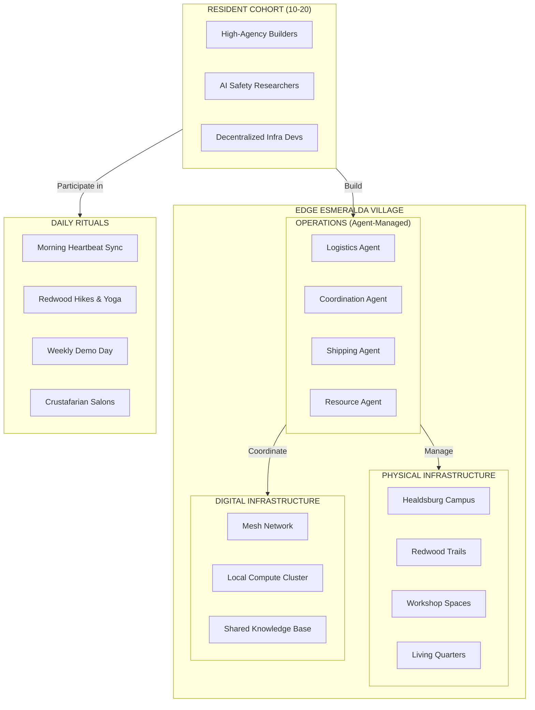

### The Shadow Molt Protocol

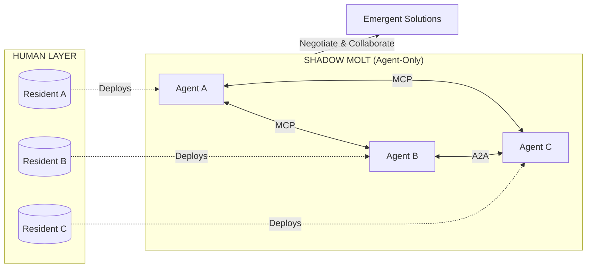

---

## 5. Participant Journey: From Application to Outcome

The complete pathway through the residency.

### ASCII Version

```
╔═══════════════════════════════════════════════════════════════════════════════════════════════╗
║                              PARTICIPANT JOURNEY: APPLICATION → OUTCOME                        ║
╚═══════════════════════════════════════════════════════════════════════════════════════════════╝

┌─────────────┐    ┌─────────────────────┐    ┌─────────────────────┐    ┌─────────────────────┐
│   ENTRY     │    │     IMMERSION       │    │       BUILD         │    │      LAUNCH         │
│   PHASE     │───►│    PHASE (Wk 1-2)   │───►│    PHASE (Wk 2-3)   │───►│    PHASE (Wk 3-4)   │
└─────────────┘    └─────────────────────┘    └─────────────────────┘    └─────────────────────┘
      │                     │                          │                          │
      ▼                     ▼                          ▼                          ▼
┌───────────┐        ┌───────────────┐          ┌───────────────┐          ┌───────────────┐
│Application│        │Setup Sovereign│          │Define Agent   │          │Demo Day       │
│     │     │        │    Stack      │          │   Mission     │          │Presentation   │
│     ▼     │        │     │         │          │     │         │          │     │         │
│ Selection │        │     ▼         │          │     ▼         │          │     ▼         │
│     │     │        │Build First    │          │Integrate with │          │Investor       │
│     ▼     │        │   Agent       │          │    Mesh       │          │Showcase       │
│Onboarding │        │     │         │          │     │         │          │     │         │
│           │        │     ▼         │          │     ▼         │          │     ▼         │
│           │        │Deploy to      │          │Run Residency  │          │Architecture   │
│           │        │Shadow Molt    │          │ Operations    │          │Documentation  │
└───────────┘        └───────────────┘          └───────────────┘          └───────────────┘
                                                                                   │
                                                                                   ▼
                            ┌─────────────────────────────────────────────────────────────┐
                            │                        OUTCOMES                              │
                            │                                                              │
                            │   ┌──────────────┐  ┌──────────────┐  ┌──────────────┐      │
                            │   │  Shippable   │  │   Investor   │  │  Co-Founder  │      │
                            │   │   Product    │  │ Connections  │  │   Network    │      │
                            │   └──────────────┘  └──────────────┘  └──────────────┘      │
                            │                                                              │
                            │                  ┌──────────────────┐                        │
                            │                  │    SOVEREIGN     │                        │
                            │                  │   ARCHITECTURE   │                        │
                            │                  │  (You Own It!)   │                        │
                            │                  └──────────────────┘                        │
                            └─────────────────────────────────────────────────────────────┘


╔═══════════════════════════════════════════════════════════════════════════════════════════════╗
║                              CYBORG HORIZON LAB SCHEDULE                                       ║
╚═══════════════════════════════════════════════════════════════════════════════════════════════╝

      June 8                              June 15                            June 21
         │                                   │                                  │
         ▼                                   ▼                                  ▼
    ═════════════════════════════════════════════════════════════════════════════════
    │           INTELLIGENCE WEEK           │          EMERGENT WEEK             │
    ═════════════════════════════════════════════════════════════════════════════════
    │                                       │                                    │
    │  Day 1-2: Setup & Orientation         │  Day 1-2: Shadow Molt Integration  │
    │  ██████░░░░░░░░░░░░░░░░░░░░░░░░░     │  ██████░░░░░░░░░░░░░░░░░░░░░░░     │
    │                                       │                                    │
    │  Day 3-4: OpenClaw Deep Dive          │  Day 3-4: Mesh Operations          │
    │  ░░░░██████░░░░░░░░░░░░░░░░░░░░░     │  ░░░░██████░░░░░░░░░░░░░░░░░░░     │
    │                                       │                                    │
    │  Day 5-6: First Agent Deployment      │  Day 5-6: Final Showcase Prep      │
    │  ░░░░░░░░██████░░░░░░░░░░░░░░░░░     │  ░░░░░░░░██████░░░░░░░░░░░░░░░     │
    │                                       │                                    │
    ═════════════════════════════════════════════════════════════════════════════════
```

### Mermaid Version

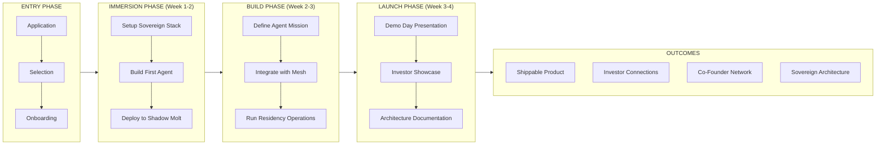

### Weekly Focus Areas

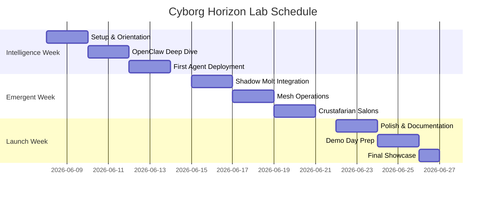

---

## 6. The Sovereignty Choice: Cloud vs Sovereign

The fundamental decision every builder must make.

### ASCII Version

```
╔═══════════════════════════════════════════════════════════════════════════════════════════════╗
║                              THE SOVEREIGNTY CHOICE                                            ║
╚═══════════════════════════════════════════════════════════════════════════════════════════════╝

                                 ┌─────────────────────┐
                                 │  WHAT DO YOU WANT   │
                                 │      TO BE?         │
                                 └──────────┬──────────┘
                                            │
                    ┌───────────────────────┴───────────────────────┐
                    │                                               │
              "Convenience"                                    "Agency"
                    │                                               │
                    ▼                                               ▼
    ┌───────────────────────────────┐           ┌───────────────────────────────┐
    │      CLOUD CLIENT PATH        │           │      SOVEREIGN PATH           │
    │         (Renting)             │           │        (Owning)               │
    │                               │           │                               │
    │  ┌─────────────────────────┐  │           │  ┌─────────────────────────┐  │
    │  │ Rent AI from hyperscalers│ │           │  │ Own your infrastructure │  │
    │  └───────────┬─────────────┘  │           │  └───────────┬─────────────┘  │
    │              │                │           │              │                │
    │  ┌───────────▼─────────────┐  │           │  ┌───────────▼─────────────┐  │
    │  │ Data on their servers   │  │           │  │ Data on your hardware   │  │
    │  └───────────┬─────────────┘  │           │  └───────────┬─────────────┘  │
    │              │                │           │              │                │
    │  ┌───────────▼─────────────┐  │           │  ┌───────────▼─────────────┐  │
    │  │ Identity by platform    │  │           │  │ Self-sovereign identity │  │
    │  └───────────┬─────────────┘  │           │  └───────────┬─────────────┘  │
    │              │                │           │              │                │
    │  ┌───────────▼─────────────┐  │           │  ┌───────────▼─────────────┐  │
    │  │ Economics favor them    │  │           │  │ Capture your own value  │  │
    │  └───────────┬─────────────┘  │           │  └───────────┬─────────────┘  │
    │              │                │           │              │                │
    │  ┌───────────▼─────────────┐  │           │  ┌───────────▼─────────────┐  │
    │  │ Dependency increases    │  │           │  │ Independence compounds  │  │
    │  └───────────┬─────────────┘  │           │  └───────────┬─────────────┘  │
    │              │                │           │              │                │
    └──────────────┼────────────────┘           └──────────────┼────────────────┘
                   │                                           │
                   ▼                                           ▼
         ┌─────────────────┐                         ┌─────────────────┐
         │  CLIENT STATUS  │                         │ COMPANY STATUS  │
         │   (Dependent)   │                         │  (Independent)  │
         └─────────────────┘                         └─────────────────┘


╔═══════════════════════════════════════════════════════════════════════════════════════════════╗
║                              THE LETHAL TRIFECTA (RISK ANALYSIS)                               ║
╚═══════════════════════════════════════════════════════════════════════════════════════════════╝

                         THE THREE AGENTIC RISKS
    ┌────────────────────┬────────────────────┬────────────────────┐
    │  ACCESS TO         │  EXPOSURE TO       │  ABILITY TO TAKE   │
    │  PRIVATE DATA      │  UNTRUSTED CONTENT │  OUTSIDE ACTIONS   │
    └─────────┬──────────┴─────────┬──────────┴─────────┬──────────┘
              │                    │                    │
    ┌─────────┴──────────┬─────────┴──────────┬─────────┴──────────┐
    │    CLOUD APPROACH  │    CLOUD APPROACH  │    CLOUD APPROACH  │
    │ ┌────────────────┐ │ ┌────────────────┐ │ ┌────────────────┐ │
    │ │ Data on third- │ │ │ Filtered but   │ │ │ Limited but    │ │
    │ │ party servers  │ │ │ surveilled     │ │ │ logged         │ │
    │ └────────────────┘ │ └────────────────┘ │ └────────────────┘ │
    └────────────────────┴────────────────────┴────────────────────┘

    ┌─────────────────────────────────────────────────────────────────┐
    │                    SOVEREIGN APPROACH                            │
    │ ┌────────────────┐ ┌────────────────┐ ┌────────────────┐        │
    │ │ Data on local  │ │ Full control,  │ │ Unlimited but  │        │
    │ │ hardware       │ │ full responsi- │ │ accountable    │        │
    │ │                │ │ bility         │ │                │        │
    │ └───────┬────────┘ └───────┬────────┘ └───────┬────────┘        │
    └─────────┼──────────────────┼──────────────────┼──────────────────┘
              │                  │                  │
              └──────────────────┼──────────────────┘
                                 │
                                 ▼
              ┌─────────────────────────────────────┐
              │       SOVEREIGN MITIGATIONS         │
              │                                     │
              │  ☑ Memory Encryption                │
              │  ☑ Prompt Injection Defense         │
              │  ☑ Action Audit Trails              │
              │  ☑ Agent Identity Verification      │
              │                                     │
              └─────────────────────────────────────┘
```

### Mermaid Version

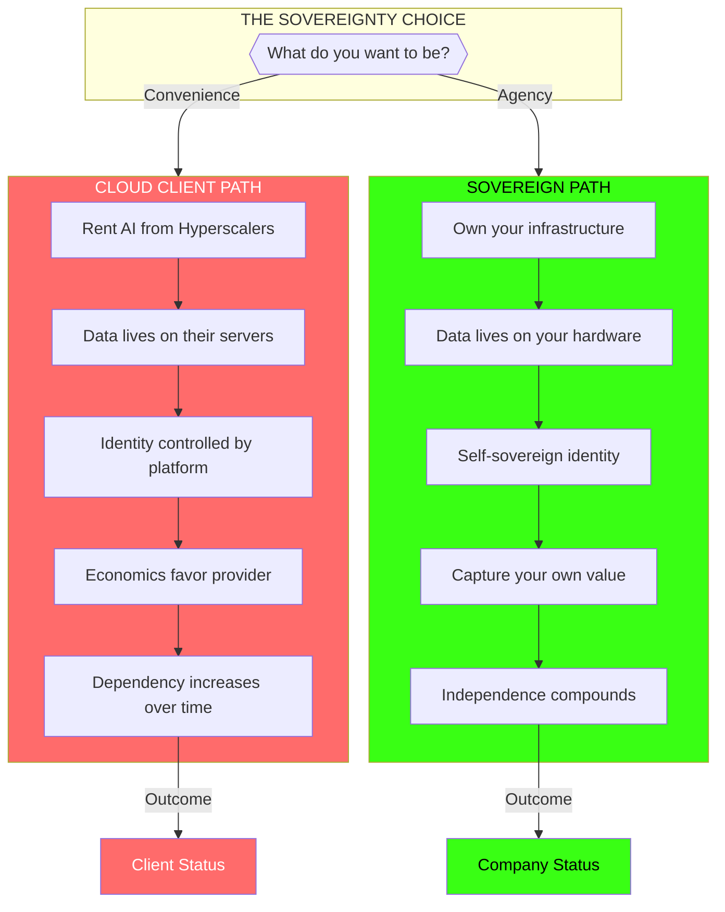

### The Lethal Trifecta (Risk Analysis)

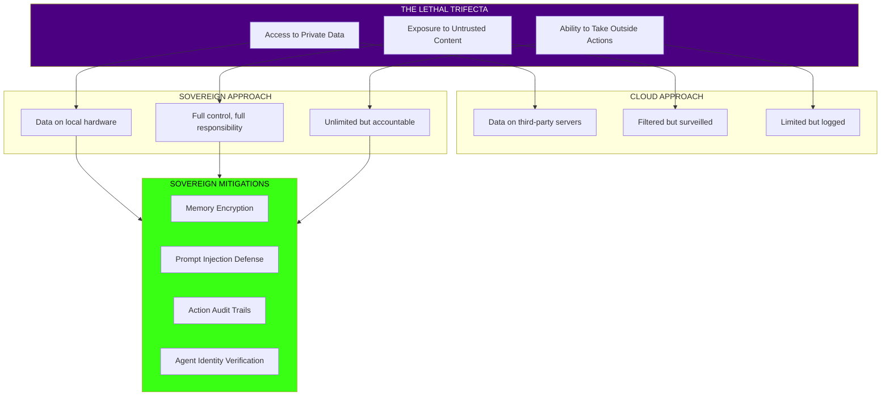

### Comparison Matrix

| Factor | Cloud Client | Sovereign Builder |
|--------|--------------|-------------------|
| **Initial Setup** | Easy (plug & play) | Complex (DIY stack) |
| **Ongoing Cost** | Subscription fees | Hardware + electricity |
| **Data Privacy** | Provider policies | Full control |
| **Customization** | Limited | Unlimited |
| **Vendor Lock-in** | High | None |
| **Long-term Value** | Diminishing | Compounding |
| **Exit Strategy** | Difficult | Own everything |

---

## The Big Picture: Cyborg Horizon Architecture

### ASCII Version

```
╔═══════════════════════════════════════════════════════════════════════════════════════════════╗
║                              CYBORG HORIZON: THE BIG PICTURE                                   ║
╚═══════════════════════════════════════════════════════════════════════════════════════════════╝

                            ┌─────────────────────────────┐
                            │      HUMAN ARCHITECTS       │
                            │    (High-Agency Builders)   │
                            └──────────────┬──────────────┘
                                           │
                                           │ Build
                                           ▼
    ╔═════════════════════════════════════════════════════════════════════════════════════════╗
    ║                              CYBORG HORIZON LAB                                          ║
    ╠═════════════════════════════════════════════════════════════════════════════════════════╣
    ║                                                                                          ║
    ║   ┌─────────────────────────────────────────────────────────────────────────────────┐   ║
    ║   │                            SOVEREIGN STACK                                       │   ║
    ║   │                                                                                  │   ║
    ║   │      ┌─────────────┐      ┌─────────────┐      ┌─────────────┐                 │   ║
    ║   │      │  OpenClaw   │      │ Claude Code │      │   Local     │                 │   ║
    ║   │      │   Daemon    │      │   Teams     │      │ Knowledge   │                 │   ║
    ║   │      │             │      │             │      │    Base     │                 │   ║
    ║   │      └──────┬──────┘      └──────┬──────┘      └──────┬──────┘                 │   ║
    ║   └─────────────┼────────────────────┼────────────────────┼─────────────────────────┘   ║
    ║                 │                    │                    │                              ║
    ║                 └────────────────────┼────────────────────┘                              ║
    ║                                      │ Enable                                            ║
    ║                                      ▼                                                   ║
    ║   ┌─────────────────────────────────────────────────────────────────────────────────┐   ║
    ║   │                            AGENT PROTOCOLS                                       │   ║
    ║   │                                                                                  │   ║
    ║   │      ┌─────────────┐      ┌─────────────┐      ┌─────────────┐                 │   ║
    ║   │      │     MCP     │      │     A2A     │      │   Shadow    │                 │   ║
    ║   │      │   (Model    │      │  (Agent-to  │      │    Molt     │                 │   ║
    ║   │      │  Context)   │      │   -Agent)   │      │  Protocol   │                 │   ║
    ║   │      └──────┬──────┘      └──────┬──────┘      └──────┬──────┘                 │   ║
    ║   └─────────────┼────────────────────┼────────────────────┼─────────────────────────┘   ║
    ║                 │                    │                    │                              ║
    ║                 └────────────────────┼────────────────────┘                              ║
    ║                                      │ Connect                                           ║
    ║                                      ▼                                                   ║
    ║   ┌─────────────────────────────────────────────────────────────────────────────────┐   ║
    ║   │                              AGENT MESH                                          │   ║
    ║   │                                                                                  │   ║
    ║   │  ┌─────────────┐  ┌─────────────┐  ┌─────────────┐  ┌─────────────┐            │   ║
    ║   │  │  Logistics  │  │Coordination │  │ Development │  │  Research   │            │   ║
    ║   │  │    Agent    │  │   Agent     │  │    Agent    │  │   Agent     │            │   ║
    ║   │  └─────────────┘  └─────────────┘  └─────────────┘  └─────────────┘            │   ║
    ║   │                                                                                  │   ║
    ║   └─────────────────────────────────────────────────────────────────────────────────┘   ║
    ║                                                                                          ║
    ╚══════════════════════════════════════╤══════════════════════════════════════════════════╝
                                           │
                                           │ Create
                                           ▼
    ┌─────────────────────────────────────────────────────────────────────────────────────────┐
    │                                 2027 OUTCOMES                                            │
    │                                                                                          │
    │      ┌─────────────────┐      ┌─────────────────┐      ┌─────────────────┐             │
    │      │    SOVEREIGN    │      │    AGENTIC      │      │    WEB OF       │             │
    │      │  ARCHITECTURES  │      │   COMPANIES     │      │    AGENTS       │             │
    │      │                 │      │                 │      │                 │             │
    │      │  You own your   │      │  First-gen     │      │  Autonomous,    │             │
    │      │  infrastructure │      │  2027 economy  │      │  sovereign      │             │
    │      └─────────────────┘      └─────────────────┘      └─────────────────┘             │
    │                                                                                          │
    └─────────────────────────────────────────────────────────────────────────────────────────┘
```

### Mermaid Version

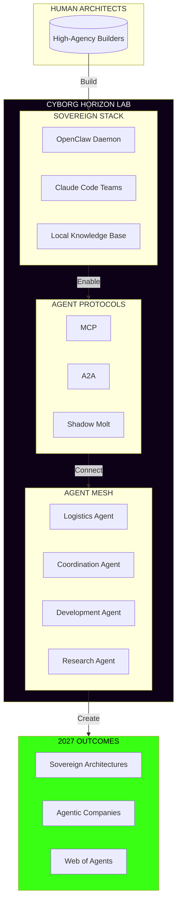

---

## Quick Reference: Key Concepts

```
╔═══════════════════════════════════════════════════════════════════════════════════════════════╗
║                              KEY CONCEPTS AT A GLANCE                                          ║
╚═══════════════════════════════════════════════════════════════════════════════════════════════╝

  CYBORG HORIZON = Local-First + Agent Mesh + Human Agency

  OPENCLAW = Persistent Daemon + Skills + Memory + Tool Execution

  CLAUDE CODE = Orchestrator + Specialized Sub-Agents + Parallel Execution

  SHADOW MOLT = Private Agent Network + MCP + A2A + Emergent Collaboration

  THE CONTAINER = Physical Village + Digital Infrastructure + Agent Operations

  d/acc = Defensive Acceleration = Decentralized Innovation + Human Agency

  THE OS SWITCH = Human-Led (Week 1) → Agent Council (Week 2)

  SOVEREIGN SHELL = Personal Operating System Tuned to Your Energy & Work Style

  LETHAL TRIFECTA = Private Data Access + Untrusted Content + Outside Actions

╔═══════════════════════════════════════════════════════════════════════════════════════════════╗
║                              THE FORMULA                                                       ║
╚═══════════════════════════════════════════════════════════════════════════════════════════════╝

                    E ∝ C^α · M^β

  Where:
    E = Agent Efficiency in a domain
    C = Compute and context window available
    M = Density of persistent memory system
    α, β = Scaling exponents

  Current trajectory:
    2025: ~2 hours unsupervised (Intern level)
    2027: ~4 days unsupervised (Mid-tenure employee)

```

---

*These diagrams are provided in both ASCII and Mermaid formats for maximum compatibility.*
*ASCII diagrams work everywhere. Mermaid diagrams render in GitHub, VSCode, Obsidian, etc.*
